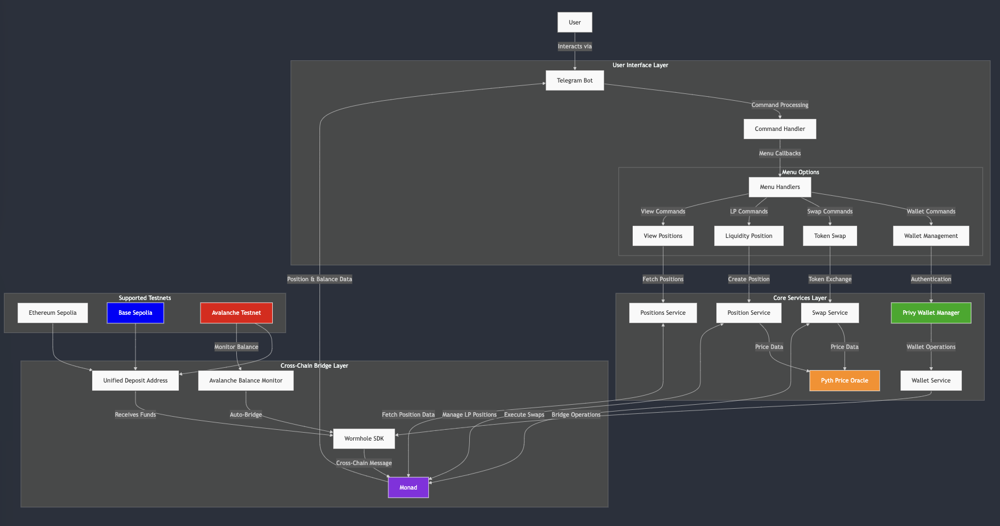

# LPNad - Liquidity Position Network Automated Daemon

Powered by

---

LPNad is a Monad liquidity management telegram bot that enables users to interact with DeFi protocols through a Telegram bot interface. The bot allows users to view positions, manage liquidity, execute swaps, and handle wallet operations across multiple blockchain networks.

## Architecture

LPNad follows a layered architecture:

1. **User Interface Layer**: Telegram Bot for user interactions
2. **Command Processing Layer**: Handles commands and menu callbacks
3. **Core Services Layer**: Manages positions, swaps, and wallet operations
4. **Cross-Chain Bridge Layer**: Facilitates automated cross-chain operations using Wormhole SDK

## Key Features

- **Multi-Chain Support**: Works with Ethereum Sepolia, Base Sepolia, and Avalanche Testnet
- **Position Management**: View and create liquidity positions
- **Token Swaps**: Execute cross-chain token swaps
- **Wallet Management**: Secure wallet operations with [Privy](https://www.privy.io/)
- **Automated Bridging**: Seamless cross-chain asset transfers using [Wormhole](https://wormhole.com/)

## Usage

1. Start a chat with the Telegram Bot
2. Use the menu options to navigate through available commands
3. Manage your liquidity positions and execute swaps
